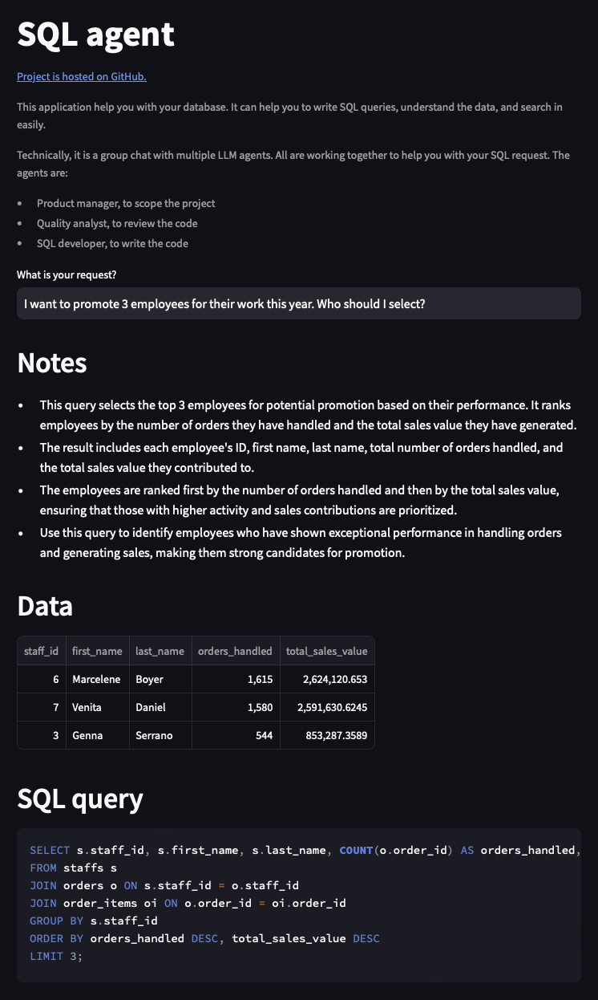

# SQL agent LLM

A SQL agent to help you with your database. It can help you to write SQL queries, understand the data, and search in easily.

## Overview

Technically, it is a group chat with multiple LLM agents: a product manager, a SQL developer, and a quality analyst. All are working together to help you with your SQL request.



### Features

> [!NOTE]
> This project is a proof of concept. It is not intended to be used in production. This demonstrates how can LLM can be used to iteratively enhance and critique its own work.

- [x] Access the system with a web browser
- [x] Include notes explaining how to use the generated queries
- [x] Query is enhanced internally by the LLM agents
- [ ] Infrastructure as code for deployment on a cloud
- [ ] Stateless architecture
- [ ] Connect to a remote database
- [ ] Use with a SSO (Single Sign-On) system

## Local installation

### Prerequisites

```dotenv
# .env
AOAI_API_KEY=xxx
AOAI_BASE_URL=https://xxx.openai.azure.com
AOAI_EMBEDDING_DEPLOYMENT=xxx
AOAI_EMBEDDING_MODEL=xxx
AOAI_LLM_DEPLOYMENT=xxx
```

```bash
make install
```

### Run

```bash
make dev
```
